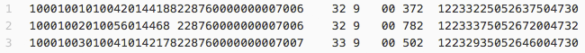
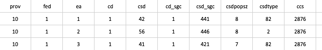
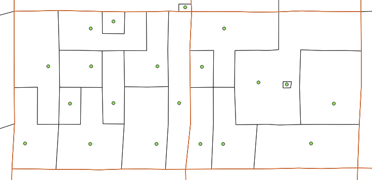

The scripts in this folder are used to convert Geographic Attribute Files (GAF) from their original ASCII text file format into .csv tables and point Shapefile while maintaining all tabular information.

#### gaf_to_csv.py
Converts the GAF.txt into a csv table using the supplied csv key code

#### csv_to_csv_by_utm.py
Divides the csv table from the previous script into separate csv tables for each utm zone. Each output table includes the epsg code in the file name.

#### csv_to_shp_batch.sh
Batch converts csv tables into point Shapefiles. Also reprojects to NAD83. Requires GDAL/OGR to be installed.

#### merge_shps.py
Merges shapefiles (e.g. from previous step) into one Shapefile. Again this requires GDAL/OGR to be installed

For some years, it is not required to separate data by UTM as there are precise fields for Latitude and Longitude.

---

In census geography attribute files, each row contains data that pertains to an Enumeration Area, typically the lowest level in which census data is available for analysis.  This data is compact and requires a record layout table to discern what each character represents.

Snippet of a geography tape file:

The script gaf_to_csv.py converts this attribute file (.txt) into a readable table (.csv) using a record layout table.

Output csv table:

This .csv table can then be converted into a point Shapefile (.shp) with ogr2ogr.  If coordinates are given in UTM, then the "csv_to_csv_by_utm.py" script will split the table by utm zone.  Then, the "csv_to_shps.sh" and "shp_merge_ogr.py" scripts can be used to create a single, full coverage, point Shapefile.  

Output points on a map with Enumeration Area (black) & Census Tract (red) boundaries

---

All scripts are under the MIT License:

---

The MIT License (MIT)

Copyright (c) 2016 Jeff Allen

Permission is hereby granted, free of charge, to any person obtaining a copy
of this software and associated documentation files (the "Software"), to deal
in the Software without restriction, including without limitation the rights
to use, copy, modify, merge, publish, distribute, sublicense, and/or sell
copies of the Software, and to permit persons to whom the Software is
furnished to do so, subject to the following conditions:

The above copyright notice and this permission notice shall be included in all
copies or substantial portions of the Software.

THE SOFTWARE IS PROVIDED "AS IS", WITHOUT WARRANTY OF ANY KIND, EXPRESS OR
IMPLIED, INCLUDING BUT NOT LIMITED TO THE WARRANTIES OF MERCHANTABILITY,
FITNESS FOR A PARTICULAR PURPOSE AND NONINFRINGEMENT. IN NO EVENT SHALL THE
AUTHORS OR COPYRIGHT HOLDERS BE LIABLE FOR ANY CLAIM, DAMAGES OR OTHER
LIABILITY, WHETHER IN AN ACTION OF CONTRACT, TORT OR OTHERWISE, ARISING FROM,
OUT OF OR IN CONNECTION WITH THE SOFTWARE OR THE USE OR OTHER DEALINGS IN THE
SOFTWARE.

---
