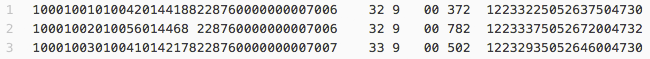
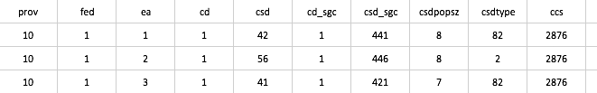
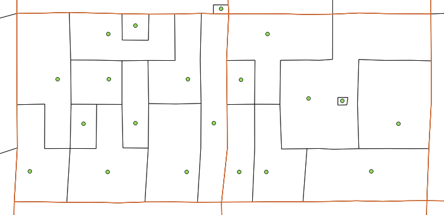

The scripts in this repository read various Statistics Canada attribute files and converts them into readable tables and point files for GIS analysis.

The following provides a bit more detail on converting specific file types.

---

#### 1 - Converting Geographic Attribute Files

In census geography attribute files, each row contains data that pertains to an Enumeration Area, typically the lowest level in which census data is available for analysis.  This data is compact and requires a record layout table to discern what each character represents.

Snippet of a geography tape file:

The script tape_to_csv.py converts this attribute file (.txt) into a readable table (.csv) using a record layout table.

Output csv table:

This .csv table can then be converted into a point Shapefile (.shp) with ogr2ogr.  If coordinates are given in UTM, then the "tape_csv_to_csv_by_utm.py" script will split the table by utm zone.  Then, the "ogr_utm_csv_to_shps.sh" and "shp_merge_ogr.py" scripts can be used to create a single, full coverage, point Shapefile.  

Output points on a map with Enumeration Area (black) & Census Tract (red) boundaries

These scripts can be strung together as one, but were left separate so data could be checked at different points during the process.  The scripts can also be altered to allow for different input or output projections or data file types as required.  They can also be altered to read other forms of tape files.
